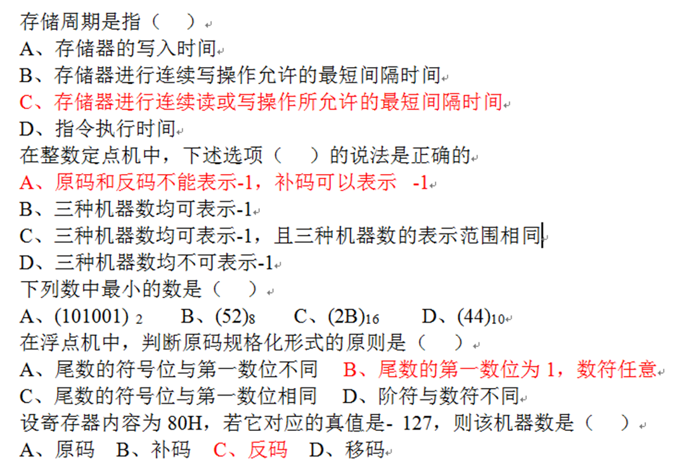
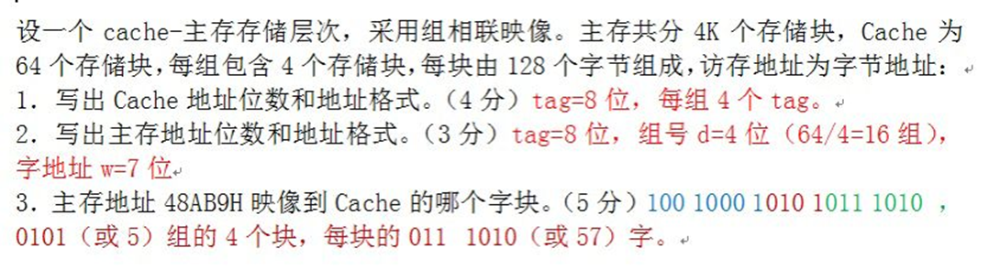
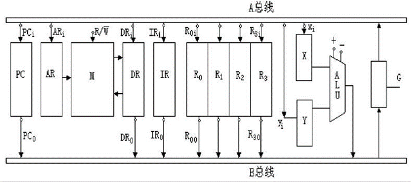
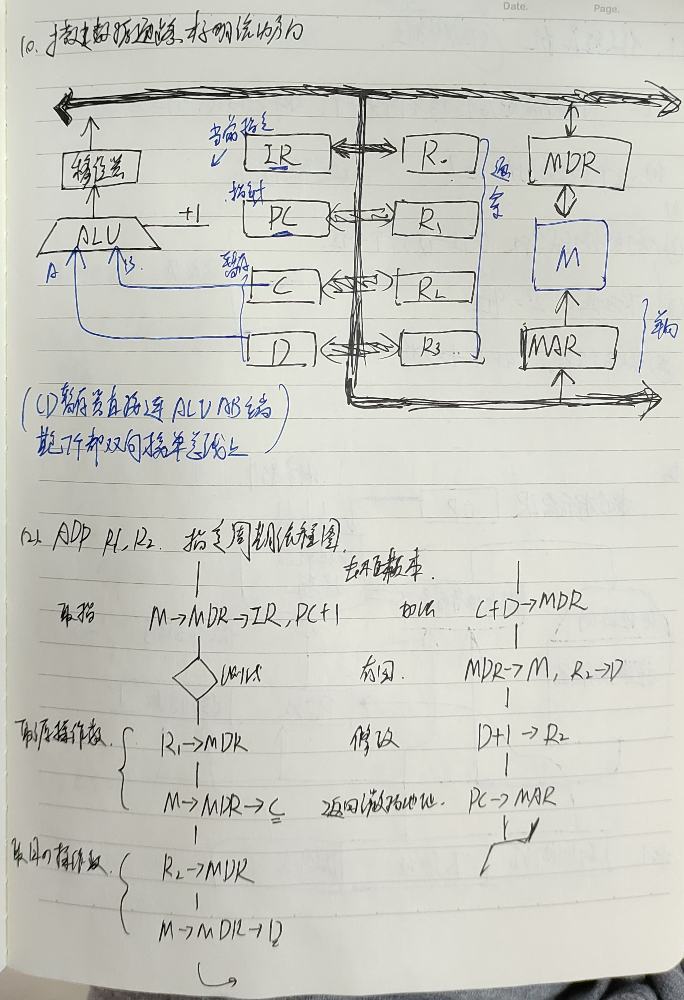
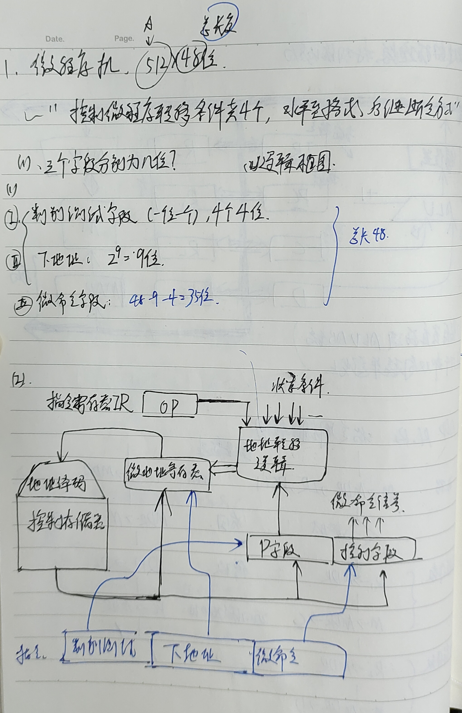

‍

6月11日在火焰山里炼丹, 早上8点写到下午两点, 总结归纳了几组题型, 同时有自己的思考

字写得很烂, 手写的就放本子里边安息罢

主文档后面可能删节一些东西, 就只传md源文件罢, Github传一百多张照片还崩溃好几次😅

--6.14

---

‍

# 数字电路

‍

各种门至少要认得

‍

摆烂了, 来扣我罢

‍

## 卡诺图

卡诺图法化简函数F(A,B,C,D)=∑m(0,1,2,5,6,7,8,9,13,14)

相邻的格子之间只有一个变量取值不同，且按照格雷码顺序排列  
将卡诺图中第 0、1、2、5、6、7、8、9、13、14 号格子填上 1，其余填上 0  
根据每个分组中不变的变量，写出每个分组对应的最小项，并用逻辑或连接起来，得到函数的最简化表达式  

‍

# 计算和数相关

‍

## 简单题

‍

​​

‍

## IEEE754

‍

### 十进制小数27/64转IEEE754

‍

类似整数二进制去抓2,4,8,16, 小数直接用1/2, 1/4, 1/8 换算为对应64为分母的量去计算即可,将十进制化为二进制, 然后规格化得到移动的位数, 然后看要求完成移码计算+127等等, 最后把Ms-E-M按要求写出

‍

### 最值范围

‍

某机字长32位，1位表示符号位。若用定点整数表示，则最小负整数为 - (2^31 - 1) (补码转原码, 需要-1

‍

IEEE754标准32位浮点数格式中，符号位为1位，阶码为8位，尾数为23位，则它所能表示的最大规格化正数为?

‍

使符号位为0，阶码为最大的非特殊值（1111 1110），尾数为最大的有效数字（111...111）：

$$
x = (-1)^S \times (1.M) \times 2^{E-127}
$$

可以得到：

$$
x = (-1)^0 \times (1.111...111) \times 2^{254-127}
$$

$$
x = 1 \times (2 - 2^{-23}) \times 2^{127}
$$

$$
x = (2 - 2^{-23}) \times 2^{127}
$$

这就是32位浮点数格式所能表示的最大规格化正数

‍

‍

## 补码计算综合

‍

补码减法 [A-B]~补~=[A]~补~+[-B]~补~

‍

手算乘除法见笔记本

考前抓集体算一下即可, 何足挂齿

‍

# 存储器相关

‍

用虚拟存储器的主要目的是**扩大存储器空间，并能进行自动管理**

‍

## 换算

‍

字长除以8即为一个存储单元包含的字节数!

32位 - 4B

1KB=2^10 , ​^1MB=2^20 ​^

‍

### 入门小菜

‍

一:

设有一个具有20位地址和64位字长（二进制）的存储器，问： 该存储器能存储多少个字节的信息？

‍

字寻址，即每个地址对应一个 64 位的字 /8= 8字节，那么它能存储的字节信息的数量是 2^20 * (64 / 8)，即 8 MiB

‍

二:

64K×32位的存储器拥有16位地址总线，是因为它可以寻址2^**16**=64K个存储单元，每个存储单元为32位（4字节）。如果用16K×8位的芯片组成它，需要字位扩展4组×4片，共需16片，系统地址线16条，芯片片内地址线14条，需2:4译码

‍

## 扩容

‍

一: 32K×8位芯片构成128×16位存储器:

‍

1. 求存储器的:数据寄存器位数, 地址寄存器位数

==等式:==

数据寄存器位数= 一个单元中的数据位数= 数据总线数= 16位

地址寄存器位数= log~2~(数据存储的地址范围)= log~2~(128K)= 地址总线数= 2^7^×2^10^= 17位

‍

2. 求几片?

16/8 × 128/32 =8 片  
2个芯片并联为一组来提供一个16位的数据, 同时需要4组串联(需要2:4译码器区分串联的不同部分)来提供存储容量**(位扩并,字扩串)**

‍

3. 画图

品鉴的够多了, 不要再端上来了

‍

‍

‍

‍

## 带宽

带宽就是物理里的流速, v=Q/t 

‍

1. 流量

    位数(32/64位) × 模块数
2. 时间

    T为存储周期, t为总线传输周期

    顺序存储时间为 m×T

    交叉存储时间为 T+(m-1)×t

‍

‍

## Cache

‍

### 命中率

‍

Tk+(T+t)(1-k) = AvTime

根据等式解方程即可(注意有的机子是同时去主存和Cache里找的,因此要小小滴改一下^（没有(1-k)(T+t)中的t）^)

‍

### 分组映射

‍

区|组|块内

组|块|块内

​​

#### 例题1

Newbing

‍

组相联cache组号的计算方法是根据主存块号和cache组数的模运算得到的

cache组号 = 主存块号 mod cache组数

例如，假设主存有4096个块，每块128字，cache有**64个行**，每行4块，那么：

* **主存块号**占22位，因为4096 = 2^12，^128 = 2^7^，所以22 = 12 + 7
* cache**组数**为16，因为64 / 4 = 16
* cache**组号**占4位，因为16 = 2^4
* **块内地址**占7位，因为128 = 2^7

‍

那么，主存地址格式为：**区号** | **组号** | **块内地址**

其中区号占18位，组号占4位，块内地址占7位。

如果要访问主存地址为：0…01 000 001110

‍

那么：

* 主存块号为0…01 000
* cache组号为0…01 000 mod 16 = 8
* 块内地址为001110

‍

#### 例题2

​​

#### 例题3

‍

一个 4 路组相联 cache 共有 128 行，主存每块 128 字，问：

1. 如果主存的容量是 2M 字，则有多少个块？

 主存的容量是 2M 字，即 2^21 字，而每块是 128 字，即 2^7 字，则主存有 2^14 个块

2. 主存中的第 300 块映射到 Cache 中哪一个组？

 取决于映射函数的选择。一种常用的映射函数是模运算，即将主存块号除以 Cache 组数，然后取余数作为 Cache 组号。如果采用这种映射函数，那么第 300 块映射到 Cache 中的第 4 组。因为 300 / 8 = 37 … 4，余数是 4。

请给出该 cache 对应的**主存地址映射格式**

|Tag|Set|Word|
| -----| -----| ------|
|6|3|7|

   其中，Tag 是用来**区分不同主存块**的标识符，Set 是用来定位 Cache 组的索引，Word 是用来定位 Cache 块中的字的偏移量。要确定每一部分的位数，我们需要知道主存地址的位数和 Cache 的参数。

假设主存地址是 **16** 位的，那么我们可以根据以下公式计算每一部分的位数：

* Word = log2(每块字数) = log2(128) = **7**
* Set = log2(组数) = log2(8) = **3**
* Tag = 主存地址位数 - Word - Set = 16 - 7 - 3 = **6**

‍

‍

# 指令相关

‍

## 格式分析

‍

模板:

1. R/S 型指令
2. 寻址方式
3. 字长, 几地址指令
4. OP(长度可以)包含几种操作

‍

## 寻址方式

‍

汇编老知识

‍

## 设计指令

‍

1. 先看机器字长和要求指令长度^（单字长? 双字长?）^确定总长度
2. 看地址空间大小选择D区长度
3. 操作码数目选择不小于^（这里指2的OP码长度的平方后的数量）^它的OP码长度
4. 指定寄存器需要的长度不小于寄存器数量
5. 寻址方式数目不小于给定的数目
6. 连接以上各项, 多余部分用来放D
7.  OP-Mode-Rn-D (单指令)  
     OP-Mode-Rn1-Mode2-Rn2-D .....(后面的地址区被挤占)

‍

### 例题

‍

某机主存容量为 4M×16 位，且存储字长等于指令字长，若该机指令系统能完成 97 种操作，操作码位数固定，且具有直接、间接、变址、基址、相对、立即等 6 种寻址方式。请回答下面的问题。

1. 画出一地址指令格式并指出各字段的作用。  
      

    |**7** **位**|**3** **位**|**6** **位**|**16** **位**|
    | --------| ------| --------| ------|
    |操作码|模式|寄存器|地址|

    操作码字段指定要执行的操作类型，例如 ADD, SUB, MOV 等。模式字段指定要使用的寻址方式，例如直接、间接、变址、基址、相对或立即。寄存器字段指定要作为源操作数或目的操作数的寄存器，取决于指令。地址字段指定另一个操作数的内存地址或立即值。
2. 写出该指令直接寻址的范围和一次间接寻址的寻址范围。  
      
    直接寻址方式使用地址字段作为内存中操作数的有效地址。直接寻址的范围是 0 到 2^16 -1，因为地址字段是 16 位长。间接寻址方式使用地址字段作为指向内存中操作数有效地址的指针。间接寻址的范围也是 0 到 65535，因为指针也是 16 位长。
3. 上述 6 种寻址方式的指令哪一种执行时间最短？哪一种便于程序的浮动？

      
    立即寻址方式有最短的执行时间，因为它不需要任何内存访问来取得操作数。相对寻址方式便于程序的重定位，因为它使用当前指令地址的偏移量来指定操作数地址。
4. 如何修改指令格式，使指令的直接寻址范围扩大到 4M？  
      
    修改指令格式以增加直接寻址范围的一种方法是使用更长的地址字段，例如 32 位。这样就可以寻址高达 4GB 的内存。但是，这也会增加指令长度并减少可用的操作码或模式数量。另一种方法是使用段寄存器来存储地址的高位，并使用地址字段作为段基址的偏移量。这样就可以每个段寻址高达 64KB的内存, 但需要事先设置段寄存器

‍

‍

# 中处相关

‍

## 知识

‍

CPU中保存当前执行指令的是? IR 

地址的是? AR

‍

操作控制器的功能是**从主存取出指令，完成指令操作码译码，并产生相关的操作控制信号，以解释执行该指令**

‍

## 指令周期流程图

‍

好难, 摆烂了.

‍

​​

IR 为指令寄存器，R0—R3 为通用寄存器，X、Y 为暂存器，ALU 为算术逻辑单元，所有箭头表示数据传输方向，按照数据通路画出“STA (R1), (R2)”的指令周期流程图，实现从内存中取出 R1 对应地址的数据，存入 R2 对应的内存地址中的功能

‍

我的建议是记忆几个指令的流程, 图很好画.

‍

‍

## 数据通路

‍

​

‍

## 微程序

‍

为确定下一条微指令的地址，通常采用断定方式，其基本思想是:

通过微指令顺序控制字段由设计者指定或由设计者指定的判别字段控制产生后继微指令地址

‍

微程序控制器中，微程序的入口地址是由机器指令的**操作码字段**形成

‍

​​

​

# 总线/IO

背就完事了

‍

## 中断

‍

CPU 响应中断的时间是**执行周期结束**

中断响应的条件是 **一条指令执行结束**

中断向量地址是**中断服务程序入口地址**

‍

## 总线

‍

系统总线中控制线的功能是 **提供主存、I/O 接口设备的控制信号响应信号, ​**地址线的功能是**指定主存和 I/O 设备接口电路的地址**

‍

**各部件的存取时间比较接近**是同步传输特点

‍

异步控制常用于**在单总线结构计算机中访问主存与外围设备时**作为其主要控制方式

‍

在三种集中式总线控制中，**独立请求方式**响应时间最快

‍

## DMA

‍

DMA 方式传送数据时，每传送一个数据，就要占用一个**存储周期**的时间

DMA 方式的数据交换是**外设与主存之间**之间建立一条直接数据通路

‍

‍

‍

---

‍

我学了个寄吧.

‍
