//TODO 同步到技艺章节, 同时放新的工作空间来保证整洁性.

删除了部分考试章节中没有的部分, 同时偷懒了一点, 毕竟目的是考试

‍

# 计算机

‍

### Tips

‍

‍

## 组成

‍

1.计算机系统的基本组成：硬件+软件

2.计算机硬件的基本组成：运算器+存储器+控制器+输入设备+输出设备

3.系统软件和应用软件

‍

​​

​​

‍

**算术逻辑部件（ALU）：**

用来进行算术逻辑运算的部件（考试时直接给出ALU简称，还好那时复习有注意到）

**指令寄存器（IR）：**

从主存取来的指令临时保存所在的寄存器

**程序计数器（PC）：**

在执行当前指令过程中，自动计算出下一条指令的地址保存所在的部件

**主存地址寄存器（MAR）：**

CPU送到地址线的主存地址线应先存放在该部件

**主存数据寄存器（MDR）：**

从数据线取来的信息所存放在该部件

​​

​​

​

​​​

​​提高并行加法器速度的关键在于加快进位产生和传递速度

​​

‍

​

​​​​

‍

## 工作过程

‍

​​

​​

​​

‍

## 属性

‍

‍

### 字长

‍

机器字长也称**字长**, 是计算机直接处理二进制数据的位数（通常和ALU直接相关）

指令字长——一个指令中包含的二进制代码的位数。

存储字长——一个存储单元中二进制代码的长度。（通常和MDR位数相同）

指令字长一般是存储字长的整数倍，若指令字长等于存储字长的2倍，则需要2次访存来取出一条指令，因此取值周期为机器周期的2倍；若指令字长等于存储字长，则取值周期等于机器周期。

‍

#### 按字寻址例题

​​

机器1：字长32bit，地址线24根；

机器2：字长16bit，地址线24根；

所以，如果按字节寻址，就是2^24=16M(B);选上B

机器1按字寻址，1字=32bit=4B 4×8 ，16M(B)/4B = 4M(Word);选上D

机器2按字寻址，1字=16bit=2B，16M(B)/2B= 8M(Word);选上A

‍

‍

### 层次结构

‍

​​

‍

#### 语言

‍

​​

‍

|**汇编程序（汇编器）**|**将汇编语言程序翻译成机器语言程序**|
| --------------------| ------------------------------------|
|解释程序（解释器）|将源程序翻译成机器指令并立即执行|
|编译程序（编译器）|将高级语言翻译城机器语言或汇编语言|

对于**高级**语言程序员来说，浮点数格式、乘法指令、数据如何在运算器中运算时透明的。对于**汇编语言**程序员，指令格式，机器构造，数据格式则不是透明的。

最后一定会变成机器语言, 因为机器语言唯一的机器可以识别与执行的语言

‍

‍

## 性能指标

‍

‍

**吞吐量**：表征一台计算机在某一时间间隔内能够处理的信息量。

​**响应时间**：表征从输入有效到系统产生响应之间的时间度量，用时间单位来度量。

**利用率**：在给定的时间间隔系统被实际使用的时间所占的比率，用百分比表示。

**处理机字长**：指处理机运算器中一次能够完成二进制数运算的位数，如 32 位、64 位。

‍

**据通路带宽**：数据总线一次所能并行传送信息的位数（各硬件部件通过数据总线传输数据）

​**存储器容量**：存储器中所有存储单元的总数目，通常用 KB、MB、GB、TB 来表示。公式一般是：位数×个数

（MAR×MDR）

​**存储器带宽**：单位时间内从存储器读出的二进制数信息量，一般用字节数/秒表示。

​**主频/时钟周期**：CPU  的工作节拍受主时钟控制，主时钟不断产生固定频率的时钟度量单位是

MHz、GHz

主频的倒数称为 CPU 时钟周期（T），T=1/f，度量单位是 μs、ns。

‍

同一型号计算机，主频越高，执行指令速度越快

‍

**CPU 执行时间**：表示 CPU 执行一般程序所占用的 CPU 时间

‍

**CPI：**

表示执行一条指令所需的时钟周期数

**用户CPU时间=程序总时钟周期数/时钟频率=程序总时钟周期数*时钟周期**

程序总时钟周期数由程序总指令条数和相应的CPI求得

‍

如果已知**程序总指令条数和综合CPI（平均CPI）**，可得：

**程序总时钟周期数=程序总指令条数*CPI**

​​

​​​

​

## 数据存储

‍

### 大小端模式

‍

大端模式：将数据的最高有效字节存放在低地址单元中

小端模式：将数据的最高有效字节存放在高地址单元中

​​

‍

‍

### 边界对齐

‍

​​

‍

## 电路

‍

//摆烂

‍

‍

## 码制

‍

### 种类

‍

#### 无符号

整个机器字长的全部二进制位均为数值位，没有符号位，相当于数的绝对值

n位的无符号数表示范围为：0 ～ 2* -1

通常只有无符号整数，而没有无符号小数

‍

加法：从最低位开始，按位相加，并往更高位进位。

‍

被减数“不变，”减数“**全部按位取反**，末位+1，**减法变加法。**

‍

‍

‍

#### 有符号

‍

带符号的整数表示：原码、补码、反码

‍

※带符号的整数运算用原码

用原码的话符号位不能参与运算，需要设计复杂的硬件电路才能处理，贵。这时候就可以利用补码来进行带符号的整数运算。

涉及原码和补码的转化

正数：原码->补码，不变

负数：原码->补码，除符号位外，各位取反，末位+1

‍

##### 原码

‍

​​

​​

##### 反码

‍

​​

##### 补码

​​

‍

##### 移码

‍

补码的基础上将符号位取反。注意：移码只能用于表示整数, 表示范围和补码相同。作用就是方便计算机比较两个数数值的大小。

‍

移码的定义：移码=真值+偏置值  
此处8位移码的偏置值=128D=1000 0000B，即2n-1

‍

偏置值一般取 2n-1，此时移码=补码符号位取反

​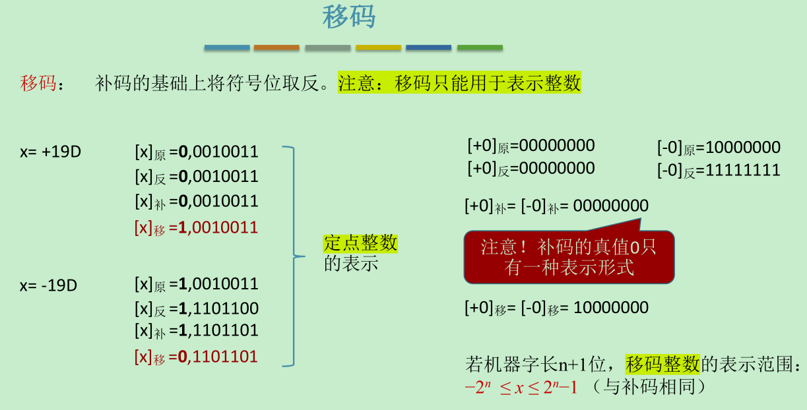​

‍

### 交互

‍

#### 特性对比

‍

移码表示的整数很方便对比大小

补码——让减法操作转变为加法操作，节省硬件成本

|**8bit**|**合法的表示范围**|**最大的数**|**最小的数**|**真值0的表示**|
| ------------| ----------| -----| ------| --------------------------|
|带符号原码|-127~127|127|-127|+0=00000000 -0=10000000|
|带符号反码|-127~127|127|-127|+0=00000000 -0=11111111|
|带符号补码|-128~127|127|-128|-/+0=00000000 只有这一种|
|无符号整数|0~255|255|0|00000000|
|带符号移码|-128~127|127|-128|0=10000000 只有这一种|

原码和反码的合法表示范围完全相同，而且都有两种表示真值0的方法。

补码的合法表示范围多一个负数，原因就是只有一种0的表示方法，因为-0的补码就是00000000

‍

​​

​​

#### 转换方法

​​​​

‍

‍

## 编程相关

‍

强制类型转化：

无损：char->int->long->double

float->double

有损：int->float,可能会损失精度

float->int，可能会溢出，也可能会损失精度

‍

# 运算

‍

### Tips

‍

## 标志位

‍

①进位标志CF (Carry Flag)只对无符号运算有意义

当运算结果的最高有效位有进位（加法）或借位（减法）时，进位标志置1，

‍

②零标志ZF (Zero Flag)

若运算结果为0，则ZF = 1；否则ZF = 0

‍

③符号标志SF (Sign Flag)只对有符号运算有意义

运算结果最高位为1，则SF = 1；否则SF = 0

‍

④溢出标志OF (Overflow Flag)只对有符号运算有意义

若算术运算的结果有溢出，则OF＝1；否则 OF＝0

‍

进位CF和溢出OF位有什么区别呢？

进位标志表示无符号数运算结果是否超出范围，运算结果仍然正确，对有符号位加减法无意义。溢出标志表示有符号数运算结果是否超出范围，运算结果已经不正确，对无符号加减无意义。

‍

‍

‍

## 校验码

​​

‍

### **奇偶校验码**

‍

奇校验码：整个校验码（有效信息位和校验位）中“1”的个数为奇数。  
偶校验码：整个校验码（有效信息位和校验位）中“1”的个数为偶数。

‍

### **海明校验码**

‍

设计思路：将信息位分组进行偶校验 —> 多个校验位—>多个校验位标注出错位置

多个校验位能携带多种状态信息，（对/错，错在哪）

‍

### **循环冗余校验码**

Cyclic Redundancy Check， CRC

  
数据发送、接受方约定一个“除数”  
K个信息位+R个校验位 作为“被除数”，添加校验位后需保证除法的余数为0  
收到数据后，进行除法检查余数是否为0, 若余数非0说明出错，则进行重传或纠错

‍

​​

## 逻辑

‍

​​

​​

‍

‍

## 移位

‍

### 算数移位

​左移1位相当于×2，右移1位相当于÷2

​原码：符号位不参与移位。左移，右移都补0

反码：符号位不参与移位。**若反码是负数补1；若反码是正数补0**

补码：符号位不参与移位。**若补码是负数左移低位补0，右移高位补1；若补码是正数，左移右移都补0**

‍

‍

​​

​​

​​

​​

‍

### 逻辑移位

‍

​逻辑右移:高位补0，低位舍弃。逻辑左移:低位补0，高位舍弃。​

‍

### 循环移位

​​

​​

‍

## 加减

​​​​

​​

‍

### 溢出

‍

双符号位补码又称：模4补码^（实际存储时只存储1个符号位，运算时会复制一个符号位）^  
单符号位补码又称：模2补码

‍

上溢:大于最大可以表示正数  
下溢:小于最小可以表示的负数

​​

​​

​​

‍

‍

### 符号扩展

‍

==定点整数==  
在原符号位和数值位中间添加新位，正数都添0；负数原码添0，负数反、补码添1

‍

==定点小数==  
在原符号位和数值位后面添加新位，正数都添0；负数原、补码添0，负数反码添1

​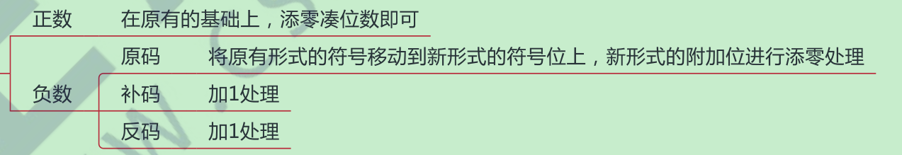​

​​

‍

## 乘除

‍

==原码==

符号位通过异或确定；数值部分通过被乘数和乘数绝对值的n轮加法、移位完成，根据当前乘数中参与运算的位确定（ACC）加什么。若当运算位=1，则（ACC）+[|x|],若为0，则(ACC)+1。每轮加法完成后， ACC,MQ的内容统一逻辑右移。

‍

最后需要单独修改符号位 =X xor/(+)^(异或)^ y, 值不相同，则异或结果为1;数值位取绝对值进行乘法计算.数值位取绝对值进行乘法计算,本身乘数的符号位不用参与运算.原码一位乘可以只用单符号位

答题时最终结果最好写为原码机器数

​移位代表ACC-MQ一个序列的运动状态

​​

==补码==

原码一位乘法和补码一位乘法的不同点

|**原码一位乘法**|**补码一位乘法**|
| -----------------------------------| ----------------------------------------------|
|进行n轮的加法、移位|进行n轮加法，移位，最后再多来一次加法|
|每次加法相加，只有两种情况+0或加x|每次加法加有三种情况，0或+x或+[-x]|
|每次移位都是逻辑右移，补1|每次都是补码的右移，正数右移补0，负数右移补1|
|符号位不参与运算|符号位参与运算|

​​

* 会添加一位辅助位
* 辅助位-MQ中“最低位”=1时，(ACC)+[X)]补
* 辅助位-MQ中“最低位”=0时，(ACC)+0
* 辅助位-MQ中“最低位”=-1时，(ACC)+[-X]补

‍

‍

### 恢复余数法

‍

手算时，每一位商取0/1 是通过判断当前余数和除数的大小确定的; 计算机很傻，会先默认上商1，如果搞错了再改上商0。并“恢复余数”

‍

ACC、MQ整体“逻辑左移”。ACC高位丢弃，MQ低位补0

‍

​​

​​

### 加减交替法

‍

例题

‍

‍

‍

## 浮点

‍

阶符^（常用补码或移码表示的定点整数，反映表示范围）^表示的是阶码正负，数符^（用原码或补码表示的定点小数，反映精度）^表示的是尾数正负

‍

  
阶码：常用补码或移码表示的定点整数  
尾数：常用原码或补码表示的定点小数  

​​​​

尾数给出一个小数，阶码指明了小数点要向前/向后移动几位

​尾数算数左移1位，阶码减1。直到尾数最高位是有效值（左规)​

​​

‍

‍

### 规格化

**规定尾数的最高位必须是有效位**

‍

”有效位“又分两种情况

原码表示的尾数视格化：**尾数的最高数值位必须是1**

补码表示的尾数规格化：**尾数最高数值位必须和尾数符号位相反**

‍

​​

​​

‍

左规：当浮点数运算的结果为非规格化时要进行规格化处理，将尾数算数左移一位，阶码减1。

右规：当**浮点数运算的结果尾数出现溢出（双符号位为01或10）时**，将尾数算数右移一位，阶码加1。

‍

采用双符号位，当发生溢出时（双符号位为01或10），可以采用右规，更高位的符号位是正确的符号位。

​​

​​

‍

### IEEE 754 

‍

    在浮点数提出的早期，各个计算机厂商各自制定自己的浮点数规则，导致不同厂商对于同一个数字的浮点数表示各不相同，在计算时还需要先进行转换才能进行计算。后来 IEEE 组织提出了浮点数的标准，统一了浮点数的格式，并规定了单精度浮点数 float 和双精度浮点数 double，从此以后各个计算机厂商统一了浮点数的格式，一直延续至今

​​

​​

​​​​

‍

​​

‍

### 运算

‍

浮点数加减运算步骤:

1. 对阶  
      小阶向大阶靠齐，方便计算机对尾数进行处理
2. 尾数加减  
      尾数常规加减
3. 规格化  
      如果尾数加减出现类似0.0099517× 10^12^ 时，需要“左规”；如果尾数加减出现类似99.517107× 10^12^ 时，需要“右规”。
4. 舍入  
      尾数位数有限，若规定只能保留6位有效尾数，则9.9517107× 1012 →9.95171× 1012 (多余的直接砍掉)或者，9.9517107× 1012 →9.95172× 1012 （若砍掉分非0，则入1)或者，也可以采用四舍五入的原则，当舍弃位≥5时，高位入1。
5. 判溢出  
      若规定阶码不能超过两位，则运算后阶码超出范围，则溢出。

​​

‍

‍

#### **舍入**

‍

有的计算机可能会把浮点数的尾数部分单独拆出去计算(24bit -> 32bit)，算完了经过舍入(32bit -> 24bit)再拼回浮点数

‍

​​

​​

‍

#### 例题

​​

​​

‍

‍

‍

# 存储

‍

### Tips

‍

辅存中的数据要调入到主存才能被CPU访问

‍

## 存储器

‍

‍

‍

### 分类

‍

​​

#### **层次结构**

‍

==寄存器-&gt;Cache-&gt;主存-&gt;辅存-&gt;外存==

Cache - 主存：解决了主存与CPU速度不匹配的问题。

主存 - 辅存：实现虚拟存储系统，解决了主存容量不够的问题。

主存 - 辅存层次不断发展，衍生出虚拟存储器系统

​

‍

​

#### 存取方式

‍

随机存取存储器（RAM），如内存；  

顺序存取存储器（SAM），如磁带；直接存取存储器（DAM），如磁盘；  

相联存储器（可按内容访问的存储器，CAM），如快表。

​​

‍

#### 信息是否可改

‍

读/写存储器

只读存储器（ROM）               

‍

#### 信息可保存

‍

易失性存储器，如主存, 内存, Cache；RAM

非易失性存储器，如磁盘、光盘; ROM

‍

#### 读出类型

‍

破坏性读出（如DRAM芯片，读出数据后要进行重写）

非破坏性读出（如SRAM芯片、磁盘、光盘）

​​

......

‍

‍

### 性能指标

‍

1. 存储容量： 存储字数 × 字长
2. 单位成本： 总成本 / 总容量
3. 数据传输率(主存带宽)^(表示每秒从主存进出信息的最大 数量，单位为字/秒、字节/秒（B/s）或位/秒（b/s）)^:  数据的宽度(存储字长) / 存储周期
4. 存取周期^（又称为读写周期或访问周期。它是指存储器进行一次完整的读写操作所需的全部时间，即连续两次独立地访问存储器操作（读或写操作）之间所需的最小时间间隔）^:  存取时间^（存取时间是指从启动一次存储器操作到完成该操作所经历的时间，分为读出时间和写入时间）^ + 恢复时间 ^(启动存取到存取完为存取时间, 存取完到下次存取为恢复时间)^

存储周期一般大于存取时间（读写操作后需要内部复原时间)

‍

**提高存储性能（速度、容量）的措施**

‍

A、双端口存储器

B、并行主存系统

C、高速缓存

D、虚拟存储

E、相联存储技术

......

‍

## 主存

‍

​​

​​

## 半导体随机存储

数据线数与地址线数共同反映存储芯片容量大小

​​

‍

### RAM

随机存储器

分为动态RAM^(Dynamic Random Access Memory)^和静态RAM^(Static Random Access Memory)^, DRAM用于主存、SRAM用于Cache

‍

核心区别：存储元不一样

DRAM芯片：使用栅极**电容**存储信息, 成本更低，集成度高，功耗低  
SRAM芯片：使用双稳态**触发器**存储信息, 成本更高，集成度低，功耗大

​

​​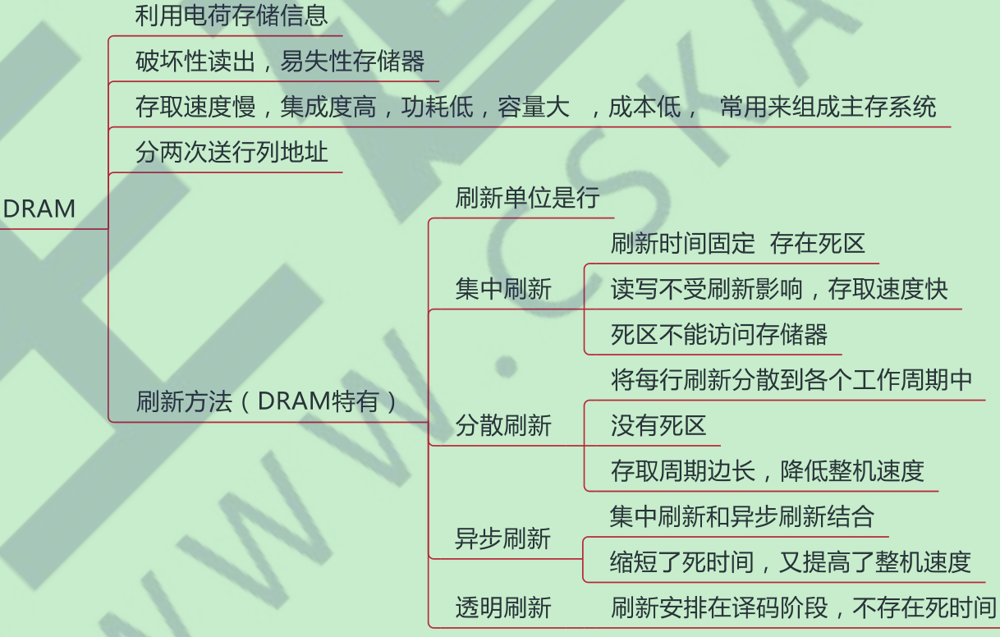​

​​

​​

|**类型特点**|**SRAM**|**DRAM**|
| --------------------| -------------| ------------|
|存储信息|触发器|电容|
|破坏性读出|非|是|
|读出后是否需要重写|不用|需要|
|运行速度|快|慢|
|集成度|低|高|
|发热量|大|小|
|存储成本|高|低|
|是否易失|易失|易失|
|是否需要刷新|不需要|需要|
|作用|常用作Cache|常用作主存|

​​

‍

‍

‍

### ROM

随机只读非易失性存储器  
结构简单，位密度比可读写存储器高

‍

​​

​​

‍

## 主存连接中处

‍

‍

### 扩展

多块存储器与CPU连接:

数据总线宽度>存储芯片字长，怎么办？——位扩展

想要扩展主存字数怎么办？——字扩展

​​

‍

‍

**位扩展法**

‍

    CPU的数据线与存储芯片的数据位数不相等，此时**必须**使用多个存储器件对**字长进行扩位(不然连传输的数据格式都不匹配)**

    增加主存储器的**容量**同时客观上让多个存储芯片**同时工作(匹配更大字长)**

​​

**字扩展法**

‍

    仅在字向扩充(单元的数量)，而位数(每个存储单元的大小)不变。需由片选信号来区分各片地址

    字扩展方法只能增加主存储器的**容量**，存取速度没有提升

‍

​​

‍

​​​​​​

‍

### 地址分配

‍

|线选法|译码片选法|
| --------------------------------------------| ------------------------------------|
|n条线n个片选信号|n条线2的n次方个片选信号|
|电路简单|电路复杂|
|地址不连续（两位举例，00和11的地址用不到）|地址连续（00和11的地址也都用到了）|

​​​​

### 连接

单块存储器与CPU连接原理：

主存器通过数据总线，地址总线和控制总线与CPU连接。地址总线的位数决定了可寻址的最大内存空间。  
控制总线指出总线周期类型和本次输入输出操作完成的时刻。

​​

‍

## 进化

‍

    随着CPU的功能不断增强，I/O设备数量不断增多，这也导致了主存的存取速度已成为计算机系统的发展瓶颈。为了解决此问题，除了寻找更高速的原件和采用存储器层次结构外，调整主存的结构也可以提高访存速度，这就涉及到了多模块存储器

‍

#### 双端口RAM

‍

    两端口实现多核CPU存储，需要有两组完全独立的数据线，地址线，控制线。支持两个CPU同时访问。

    两个端口可以同时对不同单元的地址中取数据，也可以对同一地址单元中读出数据，但是不行同时对同一单元中写入数据，也不能对同一单元一边读一边写入数据。解决办法：发出”busy“信号，其中一个CPU的访问端口暂时关闭。

​​

‍

‍

#### 多模块存储器

‍

##### 单体多字

‍

    每行只存放一个存储字变为每行存放多个存储字，这样原来一次只能读取一个存储字变为一次能读取多个存储字，这需要数据总线根数变大

‍

限制：指令和数据在主存必须是连续存放的

‍

##### 多体并行

‍

    每个模块都有相同的容量和存取速度，各模块都有独立的读写控制电路，地址寄存器，和数据寄存器，既能并行工作，又能交叉工作（一个模块进入恢复时间，另一个模块进行存取）。

‍

区别：在高位交叉中，由于下一个访问的地址还是在这个存储体上，所以必须等到恢复时间结束后才能继续访问，故不能并行访问。效果也仅仅是扩容。而在低位交叉编制中，下一个访问地址不在同一个存储体上，所以可以交叉访问，不仅扩容还加快了访问速度。当块数$m ≥\ T/r$时，能达到最佳存储效率。T为存取周期，r为存取时间。

‍

​​

‍

​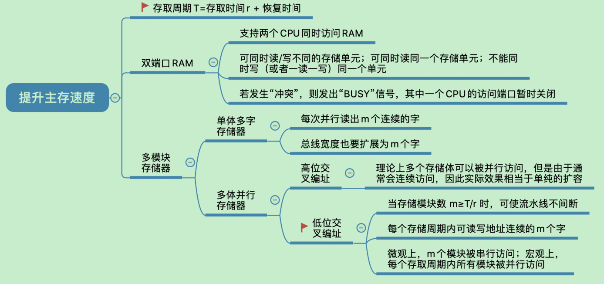​

​​

## Cache

‍

**高速缓冲存储器Cache**位于CPU和主存储器之间。CPU频率大大提高，内存的发展已经跟不上CPU访存的速度. 如果没有cache，处理器在等待数据的大部分时间内将会停滞不动。

‍

​​

‍

### 原理

‍

通常使用SRAM制造, 是存储主存中最为活跃的信息副本，按照某种策略将这些活跃的信息存入到Cache中.  
Cache命中:直接对Cache进行读操作,CPU发出读请求  
Cache不命中:CPU访问主存操作，并且将访问数据送入到Cache中. 每次被访问的主存块，一定会被立即调入Cache，而且是以块为单位进行调入

‍

Cache中的“块”也称为“行”, 将主存“分块”

CPU与cache之间交换数据的基本单位是字  
Cache与主存之间交换数据的基本单位是cache块

注意:某些计算机也可能是同时访问cache和主存

‍

**局部性原理**

==时间局部性：==

    在最近的未来要用到的信息(指令和数据)，很可能与现在正在使用的信息在存储空间上是邻近的.**如果一个数据现在被访问了，那么以后很有可能也会被访问**

‍

==空间局部性：==  
    在最近的未来要用到的信息，很可能是现在正在使用的信息**如果一个数据现在被访问了，那么它周围的数据在以后可能也会被访问**

‍

​​

‍

### 性能

‍

命中率H：CPU欲访问的信息已在Cache中的比率

‍

​​

‍

‍

### 映射方式

‍

#### 全相联

随意放

‍

​​

‍

#### 直接

只能放在一个特定的位置。Cache块号=主存块号%Cache块总数

​​

​​

    相对于全相联映射，直接映射对**Tag进行了优化**，因为主存块号最后三位地址就是Cache中的位置，所以将主存块号其余位作为标记即可

    若Cache总块数= 2n2^n2^n ,则主存块号末尾n位直接反映它在Cache的位置，所以将主存块号其余位作为标志位即可

‍

‍

#### 组相联

​​

Cache块分为若干组，每个主存块可以放到特定分组中的任意一个位置。组号=主存块号%分组数

术语: 一个组内n个Cache块就成为n路相联映射

​​

​​

||**全相联**|**直接**|**组相联**|
| --------------| --------------------------------| --------------------------------------| ------------------|
|特点|任意位置|特定位置|分组中的任意位置|
|主存地址结构|标记+块内地址|标记+**行号**+块内地址|标记+**组号**+块内地址|
|优点|Cache存储空间利用充分|对任意地址，执行对比一个 Tag，速度快|折中办法|
|缺点|可以会对比所有行的标记，速度慢|Cache空间利用不充分,命中率低|折中办法|

‍

​​

‍

##### 组相联组号计算例题

‍

组相联cache组号的计算方法是根据主存块号和cache组数的模运算得到的

cache组号 = 主存块号 mod cache组数

例如，假设主存有4096个块，每块128字，cache有64个行，每行4块，那么：

* 主存块号占22位，因为4096 = 2^12，^128 = 2^7^，所以22 = 12 + 7
* cache组数为16，因为64 / 4 = 16
* cache组号占4位，因为16 = 2^4
* 块内地址占7位，因为128 = 2^7

‍

那么，主存地址格式为：**区号** | **组号** | **块内地址**

其中区号占18位，组号占4位，块内地址占7位。

如果要访问主存地址为：0…01 000 001110

‍

那么：

* 主存块号为0…01 000
* cache组号为0…01 000 mod 16 = 8
* 块内地址为001110

​​

‍

### 替换算法

‍

全相联映射，需要在全局中选择替换哪一块  
直接映射，若非空，则直接替换(无需考虑)  
组相联，组内满了，则在组内选择替换哪一块

​​

#### 随机

‍

随机算法^（RAND, Random）^ ——若Cache已满，则随机选择一块替换; 实现简单，完全没考虑局部性原理，命中率低，实际效果很不稳定

‍

#### 先进先出

‍

先进先出算法^（FIFO, First In First Out）^ ——若Cache已满，则替换最先被调入Cache 的块; 依然没考虑局部性原理，最先被调入块也有可能是被频繁访问的

‍

#### 近期最少使用

‍

近期最少使用算法^（LRU, Least Recently Used）^ ——为每一个Cache块设置一个“计数器”，用于记录每个Cache块已经有多久没被访问了。当Cache满后替换“计数器”最大的

‍

①命中时，所命中的行的计数器清零，比其低的计数器加1，其余不变；  
②未命中且还有空闲行时，新装入的行的计数器置0，其余非空闲行全加1；  
③未命中且无空闲行时，计数值最大的行的信息块被淘汰，新装行的块的计数器置0，其余全加1。

‍

‍

基于“局部性原理”，近期被访问过的主存块，在不久的将来也很有可能被再次访问，因此淘汰最久没被访问过的块是合理的。LRU算法的实际运行效果最为优秀，Cache命中率高。  
但若被频繁访问的主存块数量 > Cache行的数量，则有可能发生“抖动”

‍

Cache块的总数=2n，则计数器只需n位

且Cache装满后所有计数器的值一定不重复

‍

‍

#### 最不经常使用

‍

最不经常使用算法^（LFU, Least Frequently Used）^ ——为每一个Cache块设置一个“计数器”，用于记录每个Cache块被访问过几次。当Cache满后替换“计数器”最小的

‍

若有多个计数器最小的行，可按行号递增、或FIFO策略进行选择

曾经被经常访问的主存块在未来不一定会用到，并没有很好地遵循局部性原理，因此实际运行效果**不如 LRU**

‍

​​

​​

### 写策略

‍

​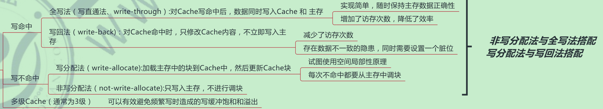​

#### 写命中

‍

写回法^（write-back）^

    只修改Cache的内容，而不立即写入主存，只有当此块被换出时才写回主存.  
    减少了访存次数，但存在数据不一致的隐患.  

搭配写分配法

‍

‍

全写法^（写直通法，write-through）^

    把数据**同时写入Cache和主存**，一般使用写缓冲^（write buffer）^

使用写缓冲，CPU写的速度很快，若写操作不频繁，则效果很好。若写操作很频繁，可能会因为写缓冲饱和而发生阻塞

‍

搭配非写分配法

‍

‍

#### 写不命中

‍

写分配法^（write-allocate）^

    把主存中的块调入Cache，在Cache中修改。    搭配写回法

‍

非写分配法^（not-write-allocate）^

    只写入主存，不调入Cache。    搭配全写法

‍

‍

#### 多级缓存

‍

现代计算机常采用多级Cache  
离CPU越近的速度越快，容量越小; 离CPU越远的速度越慢，容量越大

​​

​​

‍

## 外部存储器

‍

磁盘

‍

优点：存储容量大，价格低，长期保存而不丢失。

缺点：存取速度慢，机械结构复杂，对环境要求高

‍

固态

**SSD**

‍

优点：读写速度快。若要写的页有数据，则不能写入，需要将块内其他页全部复制到一个新的块中，再写入新的页。

缺点：价格高，有读写次数限制

‍

## 虚拟存储器

    只把当前需要的部分数据调入主存，暂不需要的部分留在辅存中。在用户看来，似乎获得了一个超大的主存（虚拟性）

‍

虚拟存储器与Cache的比较

|Cache|虚拟存储器|
| --------------------------------| ------------------------------------------------|
|解决CPU与主存速度不匹配的问题|解决主存容量的问题|
|全由硬件组成，对所有程序员透明|由OS和硬件组成，逻辑上存储器对系统程序员不透明|
|不命中影响小|不命中影响大|
|不命中时，主存直接与CPU通信|不命中时，不能直接和CPU通信，要先硬盘调入主存|

‍

### 页式

‍

‍

    一个程序(进程)在逻辑上被分为若干个大小相等的“页面”，“页面”大小与“块”的大小相同。每个页面可以离散地放入不同的主存块中。

‍

​​​

‍

​​

增加快表（存放在Cache中，先访问快表，若未命中，则去访问主存中的慢表）

​​

​​

​​

‍

### 段式

按照功能模块拆分不同的模块大小。

‍

虚拟地址：段号+段内地址

‍

优点：段的分界与程序的自然分界相对应，因而具有逻辑独立性，使得它易于编译、管理、修改和保护。

缺点：段的长度可变，分配空间不便，容易留下碎片，不好利用，造成浪费。

‍

### 段页式

把程序按逻辑结构分段，每段在分固定大小的页，主存空间也划分为大小相等的页，每个程序对应一个段表，每段对应一个页表。

‍

虚拟地址：段号+段内地址+页内地址

‍

优点是兼具段式和页式的优点缺点是需要查两次表，系统开销较大。

‍

### 快表TLB

根据局部性原理，将一些经常访问的页放入高速缓冲器中构成快表，可以极大提高查询的效率

采用相联存储器构成，可以按照内容查询  

访问顺序:TLB--->页表--->Cache--->主存

​​​​

# 指令

‍

指令^（或称, 机器指令）^是指示计算机执行某种操作的命令，是计算机运行的最小功能单位。一台计算机的所有指令的集合构成该机的指令系统，也称为指令集。

一条指令就是机器语言的一个语句，它是一组有意义的二进制代码。通常要包括操作码字段和地址码字段两部分：

    操作码：指明了“做什么”  
    地址码：指明了“对谁动手”(有的指令不需要地址码（停机）)

‍

‍

### Tips

‍

A指某个主存地址, (A)表示A所指向地址中的内容

‍

‍

‍

## 分类

‍

### 地址码个数

01234

‍

零地址指令

    不需要操作数，如空操作、停机、关中断等指令

​​

一地址指令

    只需要单个操作数，如自增，自减，取反，求补，需要两个操作数，但其中一个隐含在某个寄存器中, 完成一条指令需要3或者2次访存: 取指, 读操作数一, (写操作数一)

‍

二地址指令

    常用于两个操作数的算术运算、逻辑运算相关指令。完成一条指令需要访存四次，分别为取值，读第一个操作数，读第二个操作数，写回第一个操作数

‍

三地址指令

    常用于两个操作数的计算，结果放在第三个地址中。完成一条指令需要访存四次，分别为取值，读第一个操作数，读第二个操作数，写到第三个操作数

​​

四地址指令

    大部分同三地址指令, 正常情况取指令之后PC+1，指向下一条指令; 四地址指令执行指令后，将PC的值修改为最后一个指向地址. 完成一条指令需要访存四次，分别为取值，读第一个操作数，读第二个操作数，写到第三个操作数, 最后一个操作数为下一条将要执行的地址

​​

‍

​​

‍

‍

### **指令长度**

‍

    一条指令的总长度（可能会变）, 一般取字节的整数倍  
    指令字长会影响取指令所需时间^（如：机器字长=存储字长=16bit，则取一条双字长指令需要两次访存.）^

Ⅰ、半长指令：是机器指令长度一半

Ⅱ、单字长指令：与机器指令长度一样

Ⅲ、双字长指令：是机器指令长度两倍

‍

定长指令字结构：指令系统中所有指令的长度都相等  
变长指令字结构：指令系统中各种指令的长度不等

‍

‍

### **操作码长度**

‍

‍

定长操作码：指令系统中所有指令的操作码长度都相同, 控制器的译码电路设计简单，但灵活性较低

可变长操作码：指令系统中各指令的操作码长度可变, 控制器的译码电路设计复杂，但灵活性较高

‍

‍

‍

### **操作类型**

‍

数据传送类

CPU、主存之间的数据传送

‍

运算类

算数逻辑操作、移位操作

‍

程序控制类

改变程序执行流

‍

输入输出类

CPU、IO设备之间的数据传送

‍

​​

‍

## 扩展操作码

‍

定长指令字结构 + 可变长操作码 = 扩展操作码指令格式

‍

‍

指令是定长的，但是操作码的长度可变, 不同地址数的指令使用不同长度的操作码

‍

‍

比较

||**定长操作码**|**扩展操作码**|
| ------| --------------------------| --------------------------------|
|优点|硬件设计简单，识别速度快|在指令长度限制下仍有丰富指令|
|缺点|指令难以增加，不灵活|增加指令译码和分析难度，速度慢|

​​

‍

​​

‍

### Tips

1. 设地址长度为n，上一层留出m种状态，下一层可扩展出m×2!种状态
2. 不允许短码是长码的前缀，即短操作码不能与长操作码的前面部分的代码相同
3. 各指令的操作码一定不能重复
4. 通常情况下，使用频率高的指令使用短的操作码，减少指令译码和分析的时间。而使用频率低的指令使用长的操作码

‍

‍

### 示例

设计一套指令系统

​​

‍

​​

## 寻址方式

‍

求出操作数的真实地址称为有效地址(EA^(effective address)^)

**采用多种寻址方式的目的（缩短指令长度，扩大寻址空间，提高编程灵活性）**

‍

### 指令寻址

‍

指令地址直接由PC指出

读入一个字，根据操作码判断这条指令的总字节数n，修改PC

​​

#### 顺序寻址

‍

(PC)+“1” => PC

这里的1理解为1个指令字长，实际加的值会因指令长度、编址方式而不同

​

​

#### 跳跃寻址

‍

跳跃寻址由转移指令指出, 执行转移类指令导致的PC值改变

​​

‍

### 数据寻址

‍

由本条指令的地址码指明真实地址

​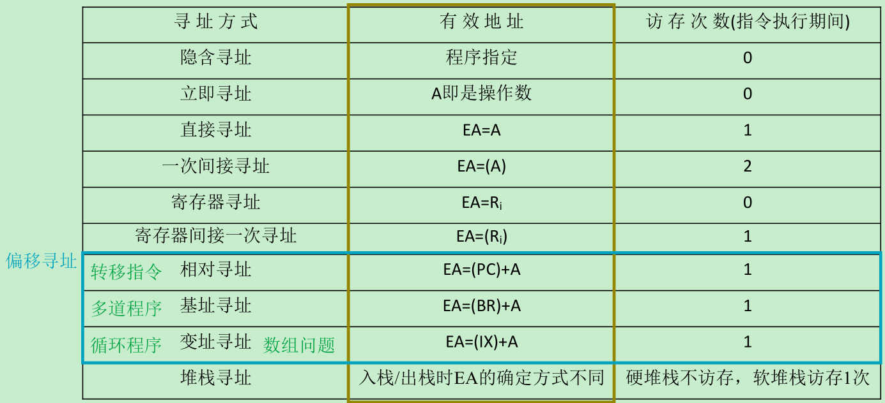​

‍

#### 非偏移寻址

‍

​​

|寻址方式|有效地址|优点|缺点|访存次数|
| ----------------| ----------------------------------| --------------------| --------------------------| ----------|
|直接寻址|操作数的真实地址|简单|限制寻址范围|1|
|间接寻址|操作数地址的地址|可扩大寻址范围|指令在执行阶段要多次访存|最少2次|
|寄存器寻址|寄存器的地址|不访问主存，速度快|寄存器昂贵|0|
|寄存器间接寻址|寄存器地址，内部是操作数主存地址|与一般的间址快|但执行仍然会访存|1|
|隐含寻址|指令中隐含操作数地址|有利于缩短指令字长|需要增加存储操作数的硬件|0|
|立即寻址|就是操作数本身|最快|限制操作数范围|0|

‍

##### 立即

就是操作数本身

最快

‍

​​

‍

##### 隐含

只需要一个地址, 另一个隐含在硬件中, 有利于缩短指令字长

需要增加存储操作数的硬件

‍

‍

##### 直接

操作数的真实地址

简单

​​​​

‍

‍

##### 间接

操作数地址的地址

可扩大寻址范围

​​​​

‍

‍

##### 寄存器

寄存器的地址

不访问主存，速度快

​​

‍

##### 寄存器间接

寄存器地址，内部是操作数主存地址

与一般的间址快

​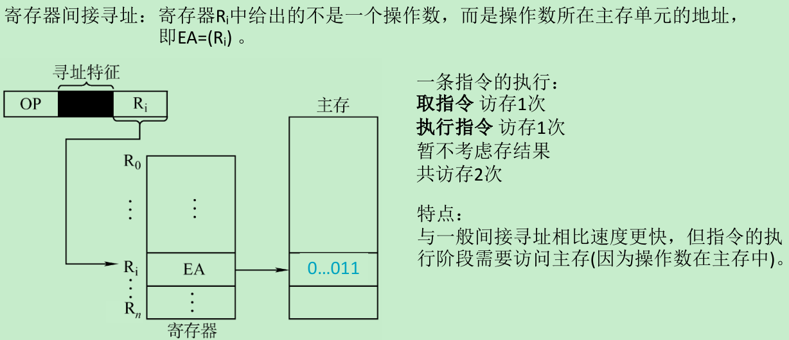​

‍

‍

​​

‍

#### 偏移寻址

‍

指令执行过程中，都会在将运算结果放入主存中，涉及一次访存。

​​

基址寻址：以程序的起始存放地址作为“起点”  
变址寻址：程序员自己决定从哪里作为“起点”  
相对寻址：以程序计数器PC所指地址作为“起点”

‍

‍

##### 基址

‍

将CPU中基址寄存器(BR)/通用寄存器的内容加上指令格式中的形式地址A，而形成操作数的有效地址

EA=(BR^(base address register)^)+A

‍

可扩大寻址范围（基址寄存器的位数大于形式地址A的位数）,便于程序“浮动”，方便实现==多道程序并发==运行

‍

​基址寄存器是面向操作系统的，其内容由**操作系统或管理程序**确定。用户无法修改，在程序执行过程中，基址寄存器的内容不变（作为基地址），==形式地址可变==（作为偏移量）

​当采用通用寄存器作为基址寄存器时，可由用户决定哪个寄存器作为基址寄存器，但其内容仍由**操作系统**确定

‍

‍

​​

​​

​​

‍

##### 变址

‍

有效地址EA等于指令字中的形式地址A与变址寄存器IX的内容相加之和，即EA= (IX^(index register)^)+A，其中IX可为变址寄存器（专用），也可用通用寄存器作为变址寄存器

‍

变址寄存器是面向用户的，在执行过程中，变址==寄存器的内容可由用户改变==（IX作为偏移量），形式地址A不变（作为基地址）。**刚好与基址寻址相反**

‍

在针对**数组处理**过程中，不断改变IX的值，便很容易形成数组中任一数据的地址，特别适合==循环程序==

‍

​​

‍

##### 相对

‍

把程序计数器PC的内容加上指令格式中的形式地址A而形成操作数的有效地址，即EA= (PC)+A，其中A是相对于PC所指地址的位移量，可正可负，补码表示

‍

优点：这段代码在程序内浮动时不用更改跳转指令的地址码, 广泛应用于==转移指令==

​​

‍

​​

#### 堆栈寻址

‍

操作数存放在堆栈中，隐含使用堆栈指针^（SP — Stack Pointer）^作为操作数地址

堆栈是存储器（或专用寄存器组）中一块特定的按“后进先出（LIFO）”原则管理的存储区，该存储区中被读/写单元的地址是用一个特定的寄存器给出的，该寄存器称为堆栈指针（SP）

硬堆栈是将寄存器作为栈，成本很高；软堆栈是将主存作为栈，成本低。  
硬堆栈不访存，软堆栈访存一次

​​

## **指令系统**

‍

**（CISC、RISC）**

|对比项目|CISC|RISC|
| ------------------| ----------------------| --------------------------|
|指令系统|复杂，庞大|简单，精简|
|指令数目|一般大于200条|一般小于100条|
|指令字长|不固定|定长|
|可访存指令|没有限制|只有Load/Store指令|
|各种指令执行时间|相差较大|绝大多数在一个周期内完成|
|各指令使用频率|有的常用，有点不常用|一般都常用|
|通用寄存器的数量|较少|多|
|控制方式|绝大多数为微程序控制|绝大多数为组合逻辑控制|
|指令流水线|可以通过一定方式实现|必须实现|

‍

CISC(复杂指令系统计算机)从编程角度出发，希望指令系统中包含的指令尽可能多，每条指令中的操作信息尽可能多。该类指令系统一般包含300-500指令。为提高机器效率，采用了向量化、超标量、超长指令字等技术。

‍

指令系统的发展趋势

早期：面向用户编程，采用CISC技术  
现代：面向系统、向高级语言靠近，采用RISC技术

‍

实际上CISC和RISC均是当前的发展(优化)趋势

‍

# 中处

‍

### Tips

‍

## CPU

‍

### 功能

1. 指令控制。完成取指令、分析指令和执行指令的操作，即程序的顺序控制。
2. 操作控制。一条指令的功能往往是由若干操作信号的组合来实现的。CPU管  
    理并产生由内存取出的每条指令的操作信号，把各种操作信号送往相应的部件，  
    从而控制这些部件按指令的要求进行动作。
3. 时间控制。对各种操作加以时间上的控制。时间控制要为每条指令按时间  
    顺序提供应有的控制信号。
4. 数据加工。对数据进行算术和逻辑运算。
5. 中断处理。对计算机运行过程中出现的异常情况和特殊请求进行处理。

‍

### 组成

‍

CPU = 运算器 + 控制器

‍

​​

​​

运算器

    对数据进行加工

‍

控制器 

    协调并控制计算机各部件执行程序的指令序列

1. 取指令：自动形成指令地址；自动发出取指令的命令。
2. 分析指令：操作码译码(分析本条指令要完成什么操作)；产生操作数的有效地址。
3. 执行指令：根据分析指令得到的“操作命令”和“操作数地址”，形成操作信号控制序列，控制运算器、存储器以及I/O设备完成相应的操作。
4. 中断处理：管理总线及输入输出；处理异常情况(如掉电)和特殊请求(如打印机请求打印一行字符)。

​​

运算器

‍

1. 算术逻辑单元：主要功能是进行算术/逻辑运算。
2. 通用寄存器组：如AX、BX、CX、DX、SP等，用于  
    存放操作数（包括源操作数、目的操作数及中间结果）  
    和各种地址信息等。SP是堆栈指针，用于指示栈顶的  
    地址。

‍

专用数据通路方式：根据指令执行过程中的数据和地址的流动方向安排连接线路

‍

方式选择:

​​

​​

​​

‍

‍

​​

​​

​​

‍

​​

‍

## 指令执行

‍

‍

### 指令周期

‍

CPU从主存中每**取出并执行**一条指令所需的全部时间

指令周期常常用若干机器周期^（CPU周期）^来表示

一个机器周期又包含若干时钟周期^（也称为节拍节拍、T周期周期或CPU时钟周期）^, 它是CPU操作的最基本单位

‍

#### 流程

‍

取指周期，在取指周期后需要判断是否有间址周期，如果没有就进入到执行周期，在执行周期后又需要判断是否有中断程序，如果有就响应中断并保存断点生成中断服务程序入口；如果没有就进入下一个取指周期。

‍

#### 内存访问

‍

四个工作周期都有CPU访存操作，目的不同。  
取指周期是为了取指令，间址周期是为了取有效地址，执行周期是为了取操作数，中断周期是为了保存程序断点

​​

‍

#### 串并行问题

‍

不同的 CPU 周期，相容性微操作, 相斥性微操作可以串行执行  
同一 CPU 周期中，相容性微操作可以并行执行

‍

### 数据流

‍

#### 取指

‍

​​

    根据PC中的内容从主存中取出指令代码并存放在IR中。而PC中存放的是指令的地址，根据这个地址从内存单元取出的是指令，并放在指令寄存器IR中，取指令的同时，PC加1。

‍

#### 间址

‍

​​

    取操作数有效地址，以一次间址为例，将指令中的地址码送到MAR并送至地址总线，此后CU向存储器发读命令，以获取有效地址并存至MDR。

‍

#### 执行

‍

根据IR中的指令字的操作码和操作数通过ALU操作产生执行结果。不同指令的执行周期操作不同，因此没有统一的数据流向

‍

‍

#### 中断

​​

中断周期的任务是处理中断请求。假设程序断点存入堆栈中，并用SP指示栈顶地址，而且进栈操作是先修改栈顶指针，后存入数据。

‍

‍

### 执行方案

‍

‍

|**单指令周期**|所有指令选用相同的执行时间（取决于最长指令执行时间），指令间串行，但原本只需要很短时间完成指令也分配了很长时间，降低整个系统运行速度|
| ------------| --------------------------------------------------------------------------------------------------------------------------------------|
|多指令周期|对不同指令选用不同的执行时间，需要更复杂的硬件设计，指令间是串行|
|流水线|在每个时钟周期让多个指令同时运行，指令间是并行|

​​

​​

‍

‍

## 数据通路

‍

‍

### 单总线结构

‍

将所有寄存器的输入端和输出端都连接在一条公共通路上。易发生冲突

​​

对于单总线的连接方式来说，ALU只能有一端与总线相连，因为两端相连就必会发生冲突。所以另一段要设计一个暂存器，先把数据放入暂存器，暂存器再与总线相连。

‍

‍

### 多总线结构

‍

多个总线上传不同的数据，提高效率

单周期就是指令在一个周期内完成，这是需要与多总线结构配合。才能使各个部件的数据传递。因为单总线一个周期内只能传递一个数据，所以指令不可能在一个周期内完成。

‍

‍

### 专用通路结构

‍

专门给某些部件设计通路。性能很高但是硬件量大

‍

​​

​​​​

‍

### 例题

‍

#### 指令数据通路

‍

    简述数据在运算器和主存之间进行存/取访问的数据通路

​​

‍

‍

##### 基本思路

利用题目提供的数据通路进行数据传送；由CU发出的控制信号实现通路的建立。

涉及的主要操作类型：  
寄存器之间的数据传送；  
主存与CPU之间的数据传送；  
使用ALU进行算术逻辑运算。

‍

取：  
M(MAR) → MDR  
(MDR) → ALU → ACC  
存：  
(ACC) → MDR  
(MDR) → M(MAR)

‍

‍

##### LDA

将存储器装入累加器或变址X指定的存储器

‍

X → MAR  
M(MAR) → MDR  
(MDR) → ALU → ACC

‍

##### ADD

ADD Y的数据通路(Y为主存地址，ADD的功能为(ACC)+(Y)→ACC)

‍

Y → MAR  
M(MAR) → MDR  
(MDR) → ALU, (ACC) → ALU  
ALU → ACC

‍

##### STA

STA^(Store the value of accumulator into memory address X)^ Z的数据通路

（Z为主存地址，STA的功能为(ACC)→z)

将累加器值存储在地址为X的主存中

‍

Z → MAR  
(ACC) → MDR  
(MDR) → M(MAR)

‍

‍

#### 指出**内部部件**

​​

d能自动“+1”，是PC, 他的内容是地址，送MAR，故c是MAR  
b与微操作信号发生器相连，是IR  
与主存相连的寄存器是MAR和MDR，c是MAR，则a是MDR

‍

‍

## 控制器

‍

结构

1. 运算器部件通过数据总线与内存储器、输入设备和输出设备传送数据
2. 输入设备和输出设备通过接口电路与总线相连接
3. 内存储器、输入设备和输出设备从地址总线接收地址信息，控制总线得控制信号，数据总线与其他部件传送数据

‍

功能

1. 主存中取出指令，产生下一条指令在主存中的地址
2. 对指令进行译码或者测试，产生相应的操作控制信号，以便启动规定的动作
3. 指挥并控制CPU、主存、输入和输出设备之间的数据流动方向​

‍

‍

根据产生微操作信号的方式不同，存在硬布线控制器和微程序控制器

‍

​​

### 硬布线

‍

    根据指令操作码、目前的机器周期、节拍信号、机器状态条件，即可确定现在这个节拍应该发出哪些'微命令'

    根据指令要求、当前的时序以及外部和内部的状态，按照时间的顺序发送一些微操作控制信号  
    又称为组合逻辑控制器

​​

#### 特点

  
指令越多，设计和实现就越复杂，因此一般用 RISC（精简指令集系统）  
如果扩充一条新的指令，则控制器的设计就需要大改，因此扩充指令较困难。  
由于使用纯硬件实现控制，因此执行速度很快。微操作控制信号由组合逻辑电路即时产生。

‍

‍

​​

​​

‍

‍

#### 设计

‍

1. 分析每个阶段的微操作序列（取值、间址、执行、中断 四个阶段）
2. 选择CPU的控制方式
3. 安排微操作时序
4. 电路设计

    (1) 列出操作时间表  
    (2)写出微操作命令的最简表达式  
    (3)画出逻辑图

​​

‍

#### 时序系统

‍

原则一 微操作的先后顺序不得随意更改  
原则二 被控对象不同的微操作尽量安排在一个节拍内完成  
原则三 占用时间较短的微操作尽量安排在一个节拍内完成并允许有先后顺序

‍

==时序层次概念==

‍

（1） 指令周期：执行一条指令所需的时间，一般由若个个机器周期（工作周期）组成，是从取指令、分指令到执行指令完所需的全部时间。

（2） 工作周期：完成一个阶段性的任务所需时间。

（3） 时钟周期：完成一个基本操作所需时间。

（4） 定时脉冲：启停控制逻辑的时钟脉冲。（工作脉冲：决定一个周期的长短）

‍

##### 时钟周期

‍

用时钟信号控制节拍发生器:每个节拍内机器可以完成或几个需要同时执行的操作

‍

##### 机器周期

‍

机器周期可视为所有指令执行过程中的一个基准时间

通常我们以存取周期作为基准时间，即从内存中读取一个指令字的最短时间作为机器周期在存储字长等于指令字长的前提下，取指周期可以作为机器周期

‍

##### 指令周期

‍

###### 取指周期

​​​​

###### 间址周期

​​

‍

###### 执行周期

​​

‍

###### 中断周期

​​

#### CPU控制方式

​​

### 微程序

‍

机器指令->微程序->微指令->微操作->微命令

​​

‍

**程序**：由指令序列组成  
**微程序**：实现一条机器指令功能的微指令序列，每一种指令对应一个微程序

‍

指令是对程序执行步骤的描述, 微指令是对指令执行步骤的描述, 指令是对微指令功能的“封装”

微命令与微操作一一对应, 微指令中可能包含多个微命令

‍

**微命令**：控制器部件向执行部件发出的控制命令，是构成控制序列的最小单位，例如打开或者关闭控制门的电位信号。是各部件完成某个基本微操作的命令

‍

**微操作**：执行部件接受微命令后所进行的操作，和微操作是一一对应的。 （实际上，微命令是微操作的控制信号，微操作是微命令的执行过程，微操作是执行部件中最基本的操作）

‍

​**微指令**：若干微命令的集合，存放在一个控制存储器中，而**存放微指令的控制存储器的单元成为微地址**。在同一CPU周期内，**并行执行的一组微命令，存储在控制存储器上面，称为一条微指令**

‍

**微周期**：从读取一条微指令，到执行执行完毕所需要的时间称为微周期。

**控制存储器**：**主存储器**，主要用来存放程序和数据，位于CPU的外部，使用的是RAM。而**控制存储器，则主要用于存储微程序，位于CPU内部，采用的是ROM**。

‍

**程序与微程序**：程序由机器指令构成，编写好以后放到主存中运行，可以改写。而微程序由微指令构成，事先编写好在CM（控制存储器）中，一般是不可改写的。微程序的作用就是实现一条对应的机器指令。

​微程序>微指令>微命令=微操作, 微操作是微命令的执行过程

‍

#### 结构

‍

​​

​​

‍

#### 原理

‍

Tips：物理上，取指周期、执行周期看起来像两个微程序，但逻辑上应该把它们看作一个整体。因此，“一条指令对应一个微程序”的说法是正确的

‍

​​

​​

​​

#### 编码方式

​​

##### **直接编码**

每个控制字段位就代表一个微命令(太笨了)，优点就是快

​优点:简单直观不需要译码，速度快，操作并行性好

缺点:对控制存储器容量有要求

​

##### **字段直接编码**

‍

‍

对于直接编码的方式最大的好处就是能够并行微操作，缩短了微命令的字段长度

**每个互斥类要留1个状态位不操作**，故为8，4，13，6，7个微命令。则需要3，2，4，3，3位共15位控制字段，而直接控制法要33位。很明显的缩减操作字段位数。

优点:缩短指令的字长

缺点:需要进行译码

互斥的指令放在相同段内，相容指令放在不同段内

‍

##### **字段间接编码**

‍

一个字段的微指令由另一个字段中的微指令解释

优点:进—步缩短指令字长  
缺点:削弱了并行控制能力，该方法只是作为辅助手段

‍

#### 地址形成

‍

断定法（根据当前执行的微指令寻找到下一条微指令）

计数器法（类似PC） 

​​

‍

##### 微指令格式

​​

​​

​​

‍

‍

## 指令流水线

‍

概念∶把一个重复的过程分解成若干个子过程，每个子过程可以与其他子过程并行执行

优点:只需要增加少量的硬件就能把计算机的运算速度提高几倍

流水线最重要的是一定要流动起来，如果经常出现断流情况，那么就无法体现流水线的优越性

‍

‍

**五段式指令流水线**

分为IF(取值),ID(译码&取数),EX(执行),M(访存),WB(写回寄存器)

只有上一条指令进入ID段后，下一条指令才能开始IF段，否则会覆盖IF段锁存器的内容

一条指令的执行过程可以分成多个阶段（或过程）。根据计算机的不同，具体的分法也不同。

‍

​​

​​​​

​​

### 分类

​​

### 影响因素

​​

‍

### 性能指标

‍

1. 吞吐率
2. 加速比
3. 效率

​​

​​

​​

‍

### 超标量流水技术

​​

## 指令周期执行模板

‍

### 取指

​​

### 间指

​​

### 执行

‍

#### 非访存

​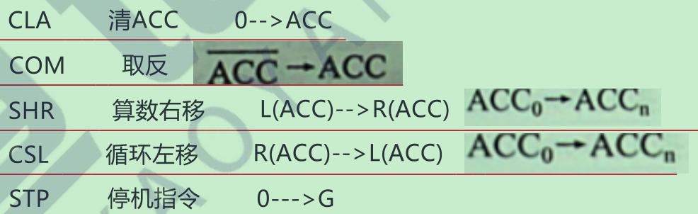​

#### 访存

​​

‍

# 总线

‍

    总线是一组能为多个部件分时共享的公共信息传送线路共享是指总线上可以挂接多个部件，各个部件之间互相交换的信息都可以通过这组线路分时共享。

‍

分时:同一时刻只允许有一个部件向总线发送信息  
共享∶总线上可以挂接多个部件，各个部件之间互相交换的信息可以通过这组线路分时共享

‍

==设备==

主设备:总线的主设备是指获得总线控制权的设备  
从设备:总线的从设备是指被主设备访问的设备，只能相应从主设备发来的各种总线命令

‍

==特性==

机械特性:尺寸形状  
电气特性∶传输方向和有效的电平范围  
功能特性:每根传输线的功能  
时间特性:信号和时序的关系

‍

==猝发传输==  
一个总线周期内传输存储地址连续的多个数据字的总线传输方式，称为猝发传输

‍

### Tips

‍

数据通路表示的是数据流经的路径  
数据总线是承载的媒介

‍

‍

## 分类

​​

​​

‍

### 功能

‍

#### 片内总线^（内部总线）^

芯片内部^（同一部件，如CPU内部连接各个寄存器及运算部件之间的总线）^的总线，是CPU芯片内部寄存器与寄存器之间，寄存器与ALU之间的公共连接线

‍

#### 系统总线

计算机系统内部功能部件（CPU、主存、I/O接口）之间相互连接的总线，可分为三类，数据总线，地址总线，控制总线

​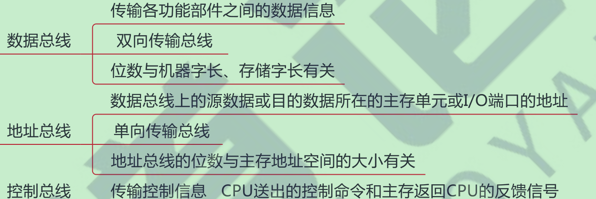​

==要素==

传输内容, 方向, 根数

‍

‍

​​

‍

#### 通信总线

‍

也称外部总线

计算机系统之间或计算机系统与其它系统之间的信息传送的总线

​​

### 结构

‍

|总线结构|单总线（常用）|双总线|三总线|
| ----------| --------------------------------------| ----------------------------------------------------------------------------| -------------------------------------------------------|
|内容|系统总线|主存总线、I/O总线|主存总线、I/O总线、DMA总线|
|结构|CPU、主存、I/O设备都连接在一组总线上|主存总线用于CPU，主存之间的传送；I/O总线用于多个外部设备与通道之间进行传送|多加的一条DMA总线是用于主存访问高速外设|
|优点|结构简单，成本低，易于接入新的设备|将较低速的I/O设备从单总线分离出来，实现存储器总线和I/O总线分离|更加提高了I/O设备的性能，更快响应命令，提高系统吞吐量|
|缺点|带宽低，负载重，不支持并发传送操作|需要增加硬件设备|系统工作效率低，同一时刻只能一个总线工作|

‍

#### 单总线

常用

​​

#### 双总线

​​

#### 三总线

​​

‍

### 数据传输格式

‍

#### 串行

优点：只需要一条传输线，成本低廉，广泛应用于长距离传输；应用于计算机内部时，可以节省布线空间。  
缺点：在数据发送和接收的时候要进行拆卸和装配，要考虑串行-并行转换的问题。

‍

#### 并行

优点：总线的逻辑时序比较简单，电路实现起来比较容易。  
缺点：信号线数量多，占用更多的布线空间；远距离传输成本高昂；由于工作频率较高时，并行的信号线之间会产生严重干扰，对每条线等长的要求也越高，所以无法持续提升工作频率。

总结

​​

‍

||**数据总线**|**地址总线**|**控制总线**|
| ----------------| --------------------| ------------------| ------------------|
|功能|传输数据信息|传输地址信息|传输控制信息|
|大小与什么有关|机器字长、存储字长|主存地址空间大小|传输一个信号|
|方向|双向|单向|既有双向也有单向|

‍

### 时序控制方式

‍

#### 同步

‍

#### 异步

异步通信还分为三类：不互锁，速度最快，可靠性最差；半互锁；全互锁。速度最慢，可靠性最好

‍

## 性能指标

‍

1. 传输周期(总线周期)
2. 时钟周期
3. 工作频率
4. 时钟频率
5. 宽度
6. 带宽
7. 复用
8. 信号线数

‍

​​​​​

‍

​​

‍

例题

​​

‍

## 仲裁

‍

当多个设备竞争总线时，由总线仲裁器进行仲裁，在微机中就是南北桥芯片组。仲裁方式分集中和竞争(分布)二种方式

‍

### 集中仲裁方式

​​

### 分布仲裁方式

‍

不需要中央仲裁器，每个潜在主模块，都有自己的仲裁号和仲裁器，然后进行仲裁号比较，获胜者仲裁号保留在仲裁总线上

‍

## 定时

‍

### 传输阶段

​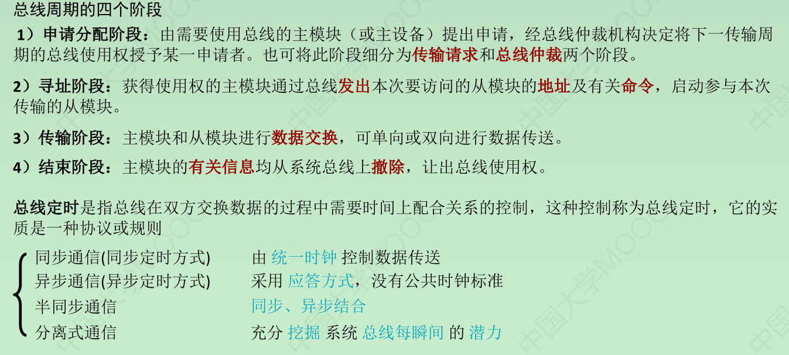​

### 同步定时

‍

适用于总线长度较短以及总线所接部件的存取时间比较接近的系统

​​

### 异步定时

​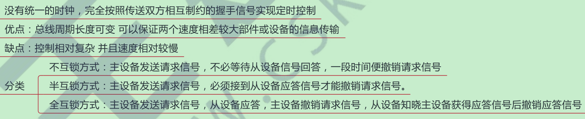​

||**同步通信**|**异步通信**|**半同步通信**|**分离式通信**|
| ------| ------------------------| --------------------------------------------| ----------------| ------------------------------|
|特点|由统一时钟控制数据传送|采用应答方式，没有公共时钟的标准|同步、异步结合|充分挖掘系统总线每瞬间的潜力|
|优点|传送速度快|保证两个工作速度相差很大的部件之间进行传输|||
|缺点|强制性同步|复杂，慢|||

‍

总线标准-不考

‍

‍

# IO

‍

输入输出系统

‍

​​

### Tips

‍

**主机与外设间的连接方式**

（1）辐射型（2）总线型（3）通道型

‍

## 组成

​​

I/O硬件, I/O软件, I/O接口

‍

I/O接口^（I/O控制器（I/O Controller））^：设备控制器，负责协调主机与外部设备之间的数据传输

​​

## IO接口

‍

### 功能

1. 实现主机和外设之间的通信联络控制: 时序配合问题，协调相互速度问题
2. 进行地址译码和设备选择
3. 实现数据的缓冲相处CPU和外设之间的速度差异
4. 信号格式转换:实现消除主机与外设之间的电平数据格式等差异
5. 传送控制命令和状态信息:协调外设的运作状态

‍

### 结构

‍

#### 内部接口

内部接口与系统总线相连（实质是与内存、CPU相连)。数据传输方式只能是并行传输

‍

#### 外部接口

外部接口通过接口电缆和外设相连。外部接口可能是串行结构所以I/O接口要有串/并转换功能

‍

### 类型

​​

‍

### 编址方式

‍

#### 统一编制

‍

I/O是看作是主存的延伸, 又称存储器映射方式，将I/O端口当做存储器单元进行地址分配

优点:不需要设置专门输入输出指令，CPU访问存储器更灵活，端口编址空间较大

缺点:端口占用存储器地址数据输入输出的时候，执行速度较慢

‍

#### 独立编制

‍

I/O编址到设备级，即一个I/O只有一个地址, 又称I/〇映射方式，I/O端口地址与存储器地址无关

优点:程序编制清晰便于理解

缺点:需要设置专门的输入/输出指令访存增加了控制的复杂性

‍

‍

||**统一编制**|**独立编制**|
| ------| ------------------------------------------------------------------------------------| -------------------------------------------------------------------------|
|内容|把外部设备的存储当成内存进行分配，有统一的地区分配，靠不同的地址区别内存和外部设备|独立编制，专门为输入/输出指令设置访问端口，靠不同指令区别内存和外部设备|
|优点|1.不需要专门的指令表示访问外存2.读写控制电路简单3，程序设计灵活性高|1.地址译码快 2.不占用主存地址空间|
|缺点|1.端口占用了主存地址空间，使主存地址空间变小2.寻址时间长（外部设备）|1.程序设计灵活差2.指令增加，控制电路复杂|

‍

‍

‍

## 控制方式

‍

​主要用于数据传输率较低的外设​

​​

较高的

​​

### 程序**查询方式**

‍

特点：CPU与I/O串行工作，CPU不断查询I/O设备状态，直到外设准备就绪。

优点：接口设计简单，设备量少。

缺点：CPU信息传送过程中要花费很多时间用于查询和等待，而且在一段时间内只能和一台外设交换信息，效率低。

‍

独占查询：CPU100%的时间都在查询I/O状态，完全串行。

定时查询：每隔一段时间CPU就查询I/O状态，查询的间隔内CPU可以执行其他程序。

‍

### 程序**中断方式**

‍

    程序中断是指在计算机执行现行程序的过程中，出现某些急需处理的异常情况或特殊请求，CPU暂时中断现行程序，而转去执行这些异常情况或特殊请求进行处理。处理完毕后又自动返回到现行程序的断点处，继续执行原程序

‍

#### 中断分类

​​

‍

单重中断：执行中断服务程序时不响应新的中断请求。

多重中断：又称中断嵌套，执行中断服务程序时可响应新的中断请求。

‍

对于多重中断有中断屏蔽技术，在中断服务开启前打开中断指令。优先级别高的中断源有权中断优先级别低的中断源。

这时候就要设置一个屏蔽触发器，1表示屏蔽该中断请求，0表示正常申请，所有屏蔽触发器构成一个屏蔽寄存器，屏蔽寄存器里面内容就是屏蔽字。

‍

‍

#### **流程**

‍

##### 中断请求

‍

*“*先说明开中断和关中断的作用，关中断保证原子操作，不会被打断，标志位*IF=1*为开中断（允许中断）*”*

CPU在统一时刻每条指令执行阶段结束前向接口发出中断查询信号，获取I/O的中断请求，也就是说， CPU响应中断的时间是在每条指令执行阶段的结束时刻。

‍

如何判断是哪个设备发来的中断信号？

会存在一个中断请求标记寄存器，里面不同位代表不同的设备中断。状态位为1的话，代表处理中断申请。

‍

CPU响应中断必须满足以下3个条件：

①中断源有中断请求。

②CPU允许中断即断开中断。

③一条指令执行完毕，且没有更紧迫的任务。

‍

##### 中断响应

‍

假如有多个程序断源同时申请，怎么专门安排优先顺序？有两种处理办法：

①硬件实现硬件排队器

②软件实现查询程序中断的优先级：

硬件故障中断>软件中断非屏蔽中断>可屏蔽中断

DMA请求>I/O设备传送的中断请求

‍

‍

##### 中断处理

‍

接收到中断信号后是怎么转到执行中断程序的？

这时候就需要中断隐指令：保存原程序的PC值，并让PC指向中断程序的第一条。

‍

**==中断隐指令==**

**任务**

‍

**①关中断。在中断服务程序中，为保护中断现场不会再被新的中断打断，就必须关中断**

**②保存断点。保证“回得来”**

**③引出中断服务。将中断服务程序入口地址传送给程序计数器**

‍

引出中断服务，如何将中断传给PC？

‍

==硬件向量法==

将硬件（中断向量地址形成部件）产生向量地址，再由向量地址找到入口地址。

‍

1. 若是通过中断向量地址形成部件直接去入口地址的话，会造成中断程序有时候长短不一，就要频繁修改中断向量地址形成部件。
2. 若是先通过向量地址，在内存中找到中断地址的话，只需修改内存的地址就可以。

‍

**==中断服务程序==**

**任务**

‍

**①保护现场。保存通用寄存器和状态寄存器的内容。**

**②中断服务。主体部分。例如将需要打印的字符传送到打印机的缓冲存储器中。**

**③恢复现场。通过出栈或取值把之前保存的信息传送回寄存器中。**

**④中断返回。通过中断返回指令回到原程序断点处。**

‍

‍

‍

总结：中断处理过程=中断隐指令+中断服务程序

‍

### **DMA方式**

‍

Direct Memory Access，直接内存访问

DMA方式是一种完全由硬件进行成组信息传送的控制方式，在外设与内存之间开辟一条“直接数据通道'适用于磁盘机磁带机等高速设备, 硬件开销大

‍

==特点==

1、内存既可以被CPU访问也可以被DMA控制器访问，CPU和DMA控制器会竞争总线的使用权，因而需要仲裁机制。

2、外部设备与内存之间的整个数据交换过程全部在DMA控制器的控制下完成，CPU能够与外部设备并行工作，大大提高了效率。

3、在DMA方式开始之前CPU要对DMA控制器进行初始化，在DMA方式结束之后，CPU要申请中断，对内存缓冲区进行后处理。

‍

==处理方式==

‍

1. 预处理：CPU完成寄存器初值设置等准备工作。
2. 数据传输：CPU继续执行主程序，DMA控制器完成数据传送
3. 后处理：CPU执行中断服务程序做DMA结束处理 DMA的传送方式：
4. 停止CPU访存：需要传送数据时，停止CPU访存，总线控制器交给DMA控制器。

‍

#### 传送方式

‍

##### 停止CPU访问主存

‍

CPU放弃地址线、数据线和有关控制线的使用权，DMA接口获得总线控制权

‍

##### DMA/CPU交替访存

‍

CPU与DMA控制器交替访问内存。不需要总线使用权的申请、建立和归还过程。效率高，但实现起来有困难，基本上不被使用。

‍

##### 周期挪用^（/周期窃取 ）^

‍

当I/O接口没有DMA请求时，CPU按程序要求访问内存；

一旦I/O接口有DMA请求，则 I/O接口挪用一个或几个周期。

缺点是：数据输入或输出过程中实际占用了CPU时间。

‍

#### 传送过程

‍

1. 预处理︰由CPU完成一些必要的准备工作（寄存器置初值、设置传送方向、启动该设备)
2. 数据传送∶DMA的数据传输可以以单字节（或字）为基本单位，也可以以数据块为基本单位，数据传送阶段完全由DMA（硬件）控制
3. 后处理:DMA控制器向CPU发送中断请求，CPU执行中断服务程序做DMA结束处理

‍

‍

DMA与中断方式的差别

||**中断**|**DMA**|
| ----------| ---------------------------------| ------------------------------------------------|
|数据传送|程序控制|硬件控制—DMA控制器。CPU只需进行预处理和后处理|
|中断请求|传送数据|向CPU报告传输结束|
|响应|指令执行周期结束后响应中断|每个机器周期结束都可，即总线空闲即可|
||||
|适用场景|CPU控制，低速设备|DMA控制器控制，高速设备|
|优先级|低于DMA|高于中断|
|工作方式|CPU与外设并行，传送与主程序串行|CPU与外设并行，传送与主程序并行|
|请求内容|请求的是CPU处理时间|请求的是总线使用权|

​​

‍

‍

### 通道方式

‍

理解为是 “弱鸡版的CPU”。通道可以识别并执行一系列通道指令，通道指令种类、功能通常比较单一

​​

‍

外设不考

‍

‍
